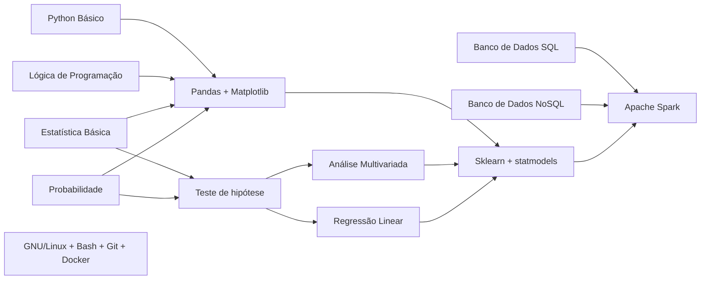

# Teo Me Refs

Repositório para divulgação de material em Data Science, Programação e Estatística.

* [Primeiros passos](#primeiros-passos)
* [Blogs](#blogs--sites)
* [Canais](#canais)
* [Livros](#livros)
* [Perfis](#perfis)
* [Podcasts](#podcasts)

## Primeiros passos

Muitos iniciantes tem dificuldade de visualizar o caminho de formação na área de dados. Tentando abstrair um pouco essa jornada, criamos o fluxo abaixo, onde tem-se as dependências de skills e temas.

Desta forma, cada nó deste grafo pode receber interação para direcionar o material focado nesta disciplina.

## Blogs & Sites
|Site|Tema|
|---|---|
|[asn.rocks](https://asn.rocks/)|Estatística e Data Science|
|[blogdoft.com.br](https://www.blogdoft.com.br/)|Desenvolvimento Web e Carreira|
|[blog.rocketseat.com.br](https://blog.rocketseat.com.br/)|Desenvolvimento Web e Mobile|
|[brasil.pyladies.com](https://brasil.pyladies.com/)|Python|
|[braziljs.org](https://braziljs.org/)|JavaScript|
|[curso-r.com](https://www.curso-r.com/)|R e Data Science|
|[datahackers.com.br](https://datahackers.com.br/)|Data Science|
|[estatisticafacil.org](http://estatisticafacil.org/)|Estatística|
|[estatsite.com.br](http://estatsite.com.br/)|Data Science|
|[felipefialho.com](https://www.felipefialho.com/)|Desenvolvimento Web|
|[gabsferreira.com](http://gabsferreira.com/)|Tecnologia e Carreira|
|[helpdev.com.br](https://helpdev.com.br/)|Programação|
|[laraveling.tech](https://laraveling.tech/)|PHP|
|[lorenakauane.com.br](https://lorenakauane.com.br/)|Desenvolvimento Web e Mobile|
|[macoratti.net](http://www.macoratti.net/)|.NET|
|[marcelamperes.wordpress.com](https://marcelamperes.wordpress.com/)|.NET e Design de Produto|
|[oestatistico.com.br](https://oestatistico.com.br/)|Estatística|
|[pizzadedados.com](https://pizzadedados.com/)|Data Science|
|[portalaction.com.br](http://www.portalaction.com.br/)|Estatística|
|[ridiculas.wordpress.com](https://ridiculas.wordpress.com/)|R e Estatística|
|[rladiesbh.com.br](https://rladiesbh.com.br/)|R|
|[sejaumdatascientist.com](https://sejaumdatascientist.com/)|Data Science|
|[willianjusten.com.br](https://willianjusten.com.br/)|Desenvolvimento Web|
|[woliveiras.com.br](https://woliveiras.com.br/)|Programação|

**[⬆ Voltar ao início](#teo-me-refs)**
## Canais

* [Twitch](#twitch)
* [YouTube](#youtube)

**[⬆ Voltar ao início](#teo-me-refs)**
### Twitch

|Canal|Tema|
|---|---|
|[abelsiqueira](https://www.twitch.tv/abelsiqueira)|Data Science|
|[ana_geek](https://www.twitch.tv/ana_geek)|Desenvolvimento de Games|
|[athos_damiani](https://www.twitch.tv/athos_damiani)|Data Science|
|[codeshow](https://www.twitch.tv/codeshow)|Desenvolvimento de Software|
|[codigofalado](https://www.twitch.tv/codigofalado)|Desenvolvimento Web|
|[dininho](https://www.twitch.tv/dininho)|Desenvolvimento de Games|
|[eduardorfs](https://www.twitch.tv/eduardorfs)|Desenvolvimento de Software|
|[glaucia_lemos86](https://www.twitch.tv/glaucia_lemos86)|Desenvolvimento Web|
|[grsoares](https://www.twitch.tv/grsoares)|IA e Desenvolvimento de Software|
|[jtrecenti](https://www.twitch.tv/jtrecenti)|Data Science|
|[marcobrunodev](https://www.twitch.tv/marcobrunodev/)|Desenvolvimento Web|
|[nomadcodemist](https://www.twitch.tv/nomadcodemist)|Desenvolvimento Web|
|[o_gabsferreira](https://www.twitch.tv/o_gabsferreira/)|Data Science Desenvolvimento Web|
|[spacedevs](https://www.twitch.tv/spacedevs)|Desenvolvimento de Software|
|[teomewhy](https://www.twitch.tv/teomewhy)|Data Science|
|[uillaz](https://www.twitch.tv/uillaz)|Desenvolvimento Web|

**[⬆ Voltar ao início](#teo-me-refs)**
### YouTube

|Canal|Tema|
|---|---|
|[ASN.Rocks](https://www.youtube.com/channel/UCKkLm58oeFM77_MwfO06Mwg)|Estatística e Data Science|
|[Azeiro Businees](https://www.youtube.com/channel/UCfTVUc_w9qJ-eLdeIQUynnw?fbclid=IwAR0hAm29c2O10OAPb5U-JLQ6rZam508oOoAJXmgCVx3t_ZlpksNDj_o37N4)|BI|
|[Canal do Yukio](https://www.youtube.com/channel/UCZDVnGEyggjuo2kgpmXdzGA?fbclid=IwAR30d4LHLF0qridCUjaloZDg1HSNVtk_hzbof7ZY2yuR-vueEfi_U-AzC_Q)|Data Science|
|[Carlos Levir](https://www.youtube.com/c/CarlosLevir)|Desenvolvimento de Software|
|[CodeShow](https://www.youtube.com/user/brunovegan)|Desenvolvimento de Software|
|[Curso-R](https://www.youtube.com/channel/UCTXuqtCYxPVEehq6fJY9GkA)|R e Data Science|
|[E AI, Carla?](https://www.youtube.com/eaicarla)|IA e Data Science|
|[Eduardo Mendes](https://www.youtube.com/user/mendesesduardo)|Desenvolvimento de Software|
|[EstaTiDados](https://www.youtube.com/channel/UC4jROkPjTvnXRkuo2GAwKXw)|Data Science|
|[Fábio Akita](https://www.youtube.com/channel/UCib793mnUOhWymCh2VJKplQ?fbclid=IwAR0UKydTeZa8GIz0H5qAgBPRD502kj9ZHFJesVUuUjp7c5QKE7m_3yBaQeM)|Desenvolvimento de Software|
|[Filipe Deschamps](https://www.youtube.com/channel/UCU5JicSrEM5A63jkJ2QvGYw)|Desenvolvimento de Software|
|[J!Quant](https://www.youtube.com/channel/UCrNTucu56jwzKJfUqsloSXQ)|Data Science|
|[Larissa Falcão](https://www.youtube.com/c/LarissaFalc%C3%A3o)|Desenvolvimento de Software|
|[Lets Data](https://www.youtube.com/c/LetsDataAI)|Data Science|
|[Lucas Montano](https://www.youtube.com/channel/UCyHOBY6IDZF9zOKJPou2Rgg)|Desenvolvimento de Software
|[Luis Filipe Pedroso](https://www.youtube.com/LuisFilipePedroso)|Desenvolvimento de Software|
|[Mario Filho - Data Science](https://www.youtube.com/channel/UCIFd_i2iwYox1PPm9rD8wFA)|Data Science|
|[Otavio Lemos](https://www.youtube.com/user/OtavioALLemos)|Desenvolvimento de Software|
|[Outspoken Market](https://www.youtube.com/user/aitechinvest)|Data Science|
|[Programação Dinâmica](https://www.youtube.com/channel/UC70mr11REaCqgKke7DPJoLg)|Data Science e Desenvolvimento de Software
|[Rafaella Ballerini](https://www.youtube.com/channel/UC_-uuuZbY0AAt9CViNzvc-Q)|Desenvolvimento de Software|
|[Seja Um Data Scientist](https://www.youtube.com/channel/UCar5Cr-pVz08GY_6I3RX9bA)|Data Science|
|[Sigmoidal](https://www.youtube.com/user/darknessdobr)|Data Science|
|[Spacedevs](https://www.youtube.com/channel/UCedHFDY78egBPEJXL2d8OiQ)|Desenvolvimento de Software|
|[Téo Me Why](https://www.youtube.com/channel/UC-Xa9J9-B4jBOoBNIHkMMKA)|Data Science|
|[Universo Programado](https://www.youtube.com/channel/UCf_kacKyoRRUP0nM3obzFbg)|IA e Desenvolvimento de Software|
|[Walmes Zeviani](https://www.youtube.com/user/walmes)|R e Estatística|

**[⬆ Voltar ao início](#teo-me-refs)**
## Livros

* [Banco de dados](#banco-de-dados)
* [Estatística](#estatística)
* [Machine Learning](#machine-Learning)
* [Programação](#programação)
* [Projetos e Equipes](#projetos-e-equipes)
* [Utilitários](#utilitários)

**[⬆ Voltar ao início](#teo-me-refs)**
### Banco de dados

[Introdução à Linguagem SQL: Abordagem Prática Para Iniciantes](https://amzn.to/3EU5Eff)

[Introdução ao Mongodb](https://amzn.to/320HLEa)

**[⬆ Voltar ao início](#teo-me-refs)**
### Estatística

[Análise de Dados Através de Métodos de Estatística Multivariada. Uma Abordagem Aplicada](https://amzn.to/3GHeMEx)

[Análise de Modelos de Regressão Linear com Aplicações](https://amzn.to/31ZmV8u)

[Análise de Séries Temporais](https://amzn.to/3oUK452)

[Análise de Sobrevivência Aplicada](https://amzn.to/3s8WFmW)

[Elementos de Amostragem](https://amzn.to/3pTC03y)

[Estatística Básica](https://amzn.to/3EWm9HV)

[Estatística Prática Para Cientistas de Dados: 50 Conceitos Essenciais](https://amzn.to/3dMZxgY)

[Probabilidade - Aplicações à Estatística](https://amzn.to/3m3l3T6)

[Probabilidade: Um Curso Moderno com Aplicações](https://amzn.to/3s3h1Os)

**[⬆ Voltar ao início](#teo-me-refs)**
### Machine Learning

[Data Science do Zero](https://amzn.to/320plDU)

[Inteligência Artificial - Uma Abordagem de Aprendizado de Máquina](https://amzn.to/3ETCexZ)

[Introduction To Statistical Learning](http://www.ime.unicamp.br/~dias/Intoduction%20to%20Statistical%20Learning.pdf)

[Machine Learning – Guia de Referência Rápida: Trabalhando com dados estruturados em Python](https://amzn.to/31UGDlD)

[Mãos à Obra: Aprendizado de Máquina com Scikit-Learn & TensorFlow](https://amzn.to/3pX1wFe)

**[⬆ Voltar ao início](#teo-me-refs)**
### Programação

[Programação Python 3](https://amzn.to/3dPipfj)

[Python Fluente: Programação Clara, Concisa e Eficaz](https://amzn.to/322T8f6)

[Python Para Análise de Dados: Tratamento de Dados com Pandas, NumPy e IPython](https://amzn.to/3IHKROx)

[Python Para Desenvolvedores](https://amzn.to/3GFLh66)

[Use a cabeça! Programação](https://amzn.to/3pTqhBZ)

[Web Scraping com Python: Coletando Mais Dados da web Moderna](https://amzn.to/3dQSELG)

**[⬆ Voltar ao início](#teo-me-refs)**
### Projetos, Equipes e Cultura

[A Regra é Não Ter Regras: A Netflix e a Cultura da Reinvenção](https://amzn.to/3DSUrKS)

[Manual de Devops. Como Obter Agilidade, Confiabilidade e Segurança em Organizações Tecnológicas](https://amzn.to/30sAr42)

[O Mítico Homem-Mês. Ensaios Sobre Engenharia de Software](https://amzn.to/3yqHTcr)

[O projeto fênix](https://amzn.to/3pYnQOA)

[O projeto unicórnio](https://amzn.to/3m3oOrN)

[Sprint. O Método Usado no Google Para Testar e Aplicar Novas Ideias em Apenas Cinco Dias](https://amzn.to/3EZnLk3)

**[⬆ Voltar ao início](#teo-me-refs)**
### Utilitários

[Introdução às Expressões Regulares](https://amzn.to/3ETyI6E)

[Git: Guia Prático](https://amzn.to/3EU4xw5)

**[⬆ Voltar ao início](#teo-me-refs)**
## Perfis

Alguns perfis para seguir

|Nome|Instagram|LinkedIn|Twitter|
|---|---|---|---|
|Adriana Silva|[@dri_chispirita](https://www.instagram.com/dri_chispirita/)|[/adrianamms](https://www.linkedin.com/in/adrianamms/)|-|
|Athos Damiani|[@athosdamiani](https://www.instagram.com/athosdamiani/)|[/athosdamiani](https://www.linkedin.com/in/athosdamiani/)|[@athos_damiani](https://twitter.com/athos_damiani)|
|Bruno Rocha|[@codeshowbr](https://www.instagram.com/codeshowbr/)|[/rochacbruno](https://www.linkedin.com/in/rochacbruno/)|[@rochacbruno](https://twitter.com/rochacbruno)
|Filipe Deschamps|[@filipedeschamps](https://www.instagram.com/filipedeschamps/)|[/filipedeschamps](https://www.linkedin.com/in/filipedeschamps/)|[@FilipeDeschamps](https://twitter.com/FilipeDeschamps)|
|Gabs Ferreira|[@o_gabsferreira](https://www.instagram.com/o_gabsferreira/)|[/gabsferreira](https://www.linkedin.com/in/gabsferreira/)|[@o_gabsferreira](https://twitter.com/o_gabsferreira)|
|Glaucia Lemos|[@glaucia.lemos.dev](https://www.instagram.com/glaucia.lemos.dev/)|[/glaucialemos](https://www.linkedin.com/in/glaucialemos/)|[@glaucia_lemos86](https://twitter.com/glaucia_lemos86)
|Jayme Anchante|-|[/jaymeanchante](https://www.linkedin.com/in/jaymeanchante/)|-|
|Joao Paulo Nogueira|-|[/joaopaulonogueira](https://www.linkedin.com/in/joaopaulonogueira/)|[@joaopcnogueira](https://twitter.com/joaopcnogueira)|
|Julio Trecenti|-|[/jtrecenti](https://www.linkedin.com/in/jtrecenti/)|[@jtrecenti](https://twitter.com/jtrecenti)|
|Kizzy Terra|[@kizzy_terra](https://www.instagram.com/kizzy_terra/)|[/kizzyterra](https://www.linkedin.com/in/kizzyterra/)|[@kizzy_terra](https://twitter.com/kizzy_terra)|
|Lucas Montano|[@lucasmontano](https://www.instagram.com/lucasmontano/)|[/lucasmontano](https://www.linkedin.com/in/lucasmontano/)|[@lucas_montano](https://twitter.com/lucas_montano)|
Mario Filho|[@mariofilhoml](https://www.instagram.com/mariofilhoml/)|[/mariofilho](https://www.linkedin.com/in/mariofilho/)|[@MarioFilhoCom](https://twitter.com/MarioFilhoCom)|
|Meigarom Lopes|-|[/meigarom](https://www.linkedin.com/in/meigarom/?miniProfileUrn=urn%3Ali%3Afs_miniProfile%3AACoAAAazy44B0cQNwp2I0oq0SIVQRGDQseeySkg)|[@Meigarom](https://twitter.com/Meigarom)|
|Raniere Ramos|[@oestatistico](https://www.instagram.com/oestatistico/)|[/raniereramos](https://www.linkedin.com/in/raniereramos/)|[@oestatisticoweb](https://twitter.com/oestatisticoweb)
|Rodrigo Santana Ferreira||[/rodrigosantana](https://www.linkedin.com/in/rodrigo-santana-ferreira-0ab041128/)||
|Spacedevs|[spacedevs](https://www.instagram.com/spacedevs/)||[@spadevs](https://twitter.com/spadevs)|
|Téo Calvo|[@teo.calvo](https://www.instagram.com/teo.calvo)|[/teocalvo](https://www.linkedin.com/in/teocalvo/)|[@TeoCalvo](https://twitter.com/TeoCalvo)|
|Thiago Marques|-|[/thiagoestatidados](https://www.linkedin.com/in/thiagoestatidados/)|-|

**[⬆ Voltar ao início](#teo-me-refs)**
## Podcasts

|Nome|Tema|
|---|---|
|[Carreira Sem Fronteiras](https://www.carreirasemfronteiras.com.br/)|Tecnologia e Carreira|
|[DataHackers](https://open.spotify.com/show/1oMIHOXsrLFENAeM743g93)|Data Science|
|[Depois do Café](https://open.spotify.com/show/4cqX5o40bClwqtYHv9X7Lp?si=6ml1VsFaTTCmQ5UzkxyAyg)|Tecnologia e Carreira|
|[Hipsters Ponto Tech](https://open.spotify.com/show/2p0Vx75OmfsXktyLBuLuSf?si=4x-AM7qRTgmZKu1AR96hKQ)|Tecnologia e Carreira|
|[Pizza de Dados](https://podcast.pizzadedados.com/)|Data Science|
|[Quebradev](https://quebradev.com.br/)|Tecnologia e Carreira|
