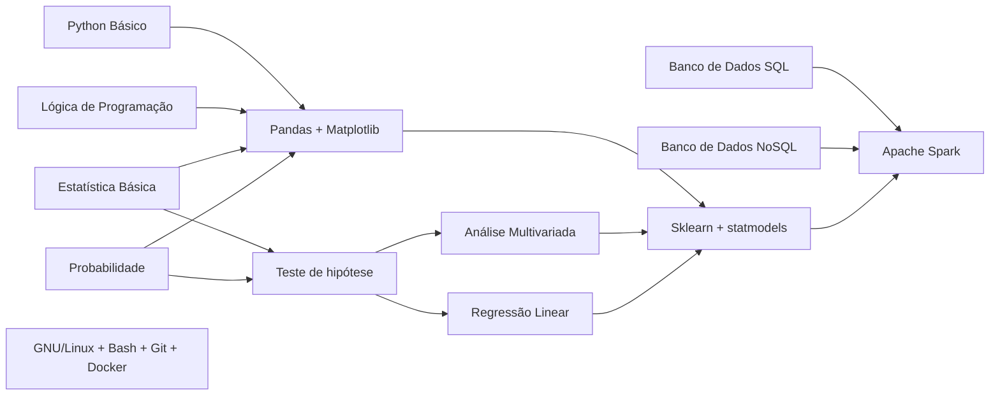

# Teo Me Refs

Repositório para divulgação de material em Data Science, Programação e Estatística.

* [Primeiros passos](#primeiros-passos)
* [Temas](#temas)
* [Blogs](#blogs--sites)
* [Perfis](#perfis)
* [Podcasts](#podcasts)

## Primeiros passos

Muitos iniciantes tem dificuldade de visualizar o caminho de formação na área de dados. Tentando abstrair um pouco essa jornada, criamos o fluxo abaixo, onde tem-se as dependências de skills e temas.

Desta forma, cada nó deste grafo pode receber interação para direcionar o material focado nesta disciplina.

**[⬆ Voltar ao início](#teo-me-refs)**
## Temas

* [Banco de dados](#banco-de-dados)
* [Estatística](#estatística)
* [Machine Learning](#machine-Learning)
* [Programação](#programação)
* [Projetos e Equipes](#projetos-equipes-e-cultura)
* [Utilitários](#utilitários)

### Banco de dados

#### Livros
- [Introdução à Linguagem SQL: Abordagem Prática Para Iniciantes](https://amzn.to/3EU5Eff)
- [Introdução ao Mongodb](https://amzn.to/320HLEa)

#### Cursos
- [Descomplicando SQL - LinuxTips feat. Téo Me Why](https://www.linuxtips.io/course/descomplicando-sql)
- [Trilha SQL - Téo Me Why](https://www.twitch.tv/collections/IkuI3yO-ShZO-g)
- [SQL - Dados GC](https://www.twitch.tv/collections/1GD1BC-Y3BbhgA)

### Estatística

#### Livros
- [Análise de Dados Através de Métodos de Estatística Multivariada. Uma Abordagem Aplicada](https://amzn.to/3GHeMEx)
- [Análise de Modelos de Regressão Linear com Aplicações](https://amzn.to/31ZmV8u)
- [Análise de Séries Temporais](https://amzn.to/3oUK452)
- [Análise de Sobrevivência Aplicada](https://amzn.to/3s8WFmW)
- [Elementos de Amostragem](https://amzn.to/3pTC03y)
- [Estatística Básica](https://amzn.to/3EWm9HV)
- [Estatística Prática Para Cientistas de Dados: 50 Conceitos Essenciais](https://amzn.to/3dMZxgY)
- [Probabilidade - Aplicações à Estatística](https://amzn.to/3m3l3T6)
- [Probabilidade: Um Curso Moderno com Aplicações](https://amzn.to/3s3h1Os)

#### Cursos
- [Estatística para Você - Téo Me Why](https://www.twitch.tv/collections/GnvvyiEhhBdCuA)

### Machine Learning

#### Livros
- [Data Science do Zero](https://amzn.to/320plDU)
- [Inteligência Artificial - Uma Abordagem de Aprendizado de Máquina](https://amzn.to/3ETCexZ)
- [Introduction To Statistical Learning](http://www.ime.unicamp.br/~dias/Intoduction%20to%20Statistical%20Learning.pdf)
- [Machine Learning – Guia de Referência Rápida: Trabalhando com dados estruturados em Python](https://amzn.to/31UGDlD)
- [Mãos à Obra: Aprendizado de Máquina com Scikit-Learn & TensorFlow](https://amzn.to/3pX1wFe)

#### Cursos
- [Introdução à Machine Learning - Téo Me Why](https://www.twitch.tv/collections/vrRnPxxEgxYPpg)
- [Projeto Assinaturas - Téo Me Why](https://www.twitch.tv/collections/xDcbIHun4xYMFA)
- [Churn Assinaturas GC - Téo Me Why](https://www.twitch.tv/collections/-iVyOjw2ARc93A)
- [Machine Learing do início ao fim - Téo Me Why](https://www.twitch.tv/collections/sG1UU3C2UheIPg)

### Programação

#### Livros
- [Programação Python 3](https://amzn.to/3dPipfj)
- [Python Fluente: Programação Clara, Concisa e Eficaz](https://amzn.to/322T8f6)
- [Python Para Análise de Dados: Tratamento de Dados com Pandas, NumPy e IPython](https://amzn.to/3IHKROx)
- [Python Para Desenvolvedores](https://amzn.to/3GFLh66)
- [Use a cabeça! Programação](https://amzn.to/3pTqhBZ)
- [Web Scraping com Python: Coletando Mais Dados da web Moderna](https://amzn.to/3dQSELG)

#### Cursos
- [Introdução à Programação com Python - Teo Me Why](https://www.twitch.tv/collections/KsRwA0OEbhd_Gw)
- [Desbravando Pandas - Téo Me Why](https://www.twitch.tv/collections/Y1BKVydmeRe1YQ)

### Projetos, Equipes e Cultura

#### Livros
- [A Regra é Não Ter Regras: A Netflix e a Cultura da Reinvenção](https://amzn.to/3DSUrKS)
- [Manual de Devops. Como Obter Agilidade, Confiabilidade e Segurança em Organizações Tecnológicas](https://amzn.to/30sAr42)
- [O Mítico Homem-Mês. Ensaios Sobre Engenharia de Software](https://amzn.to/3yqHTcr)
- [O projeto fênix](https://amzn.to/3pYnQOA)
- [O projeto unicórnio](https://amzn.to/3m3oOrN)
- [Sprint. O Método Usado no Google Para Testar e Aplicar Novas Ideias em Apenas Cinco Dias](https://amzn.to/3EZnLk3)

### Utilitários

#### Livros
- [Introdução às Expressões Regulares](https://amzn.to/3ETyI6E)
- [Git: Guia Prático](https://amzn.to/3EU4xw5)

**[⬆ Voltar ao início](#teo-me-refs)**
## Blogs & Sites
|Site|Tema|
|---|---|
|[asn.rocks](https://asn.rocks/)|Estatística e Data Science|
|[blogdoft.com.br](https://www.blogdoft.com.br/)|Desenvolvimento Web e Carreira|
|[blog.rocketseat.com.br](https://blog.rocketseat.com.br/)|Desenvolvimento Web e Mobile|
|[brasil.pyladies.com](https://brasil.pyladies.com/)|Python|
|[braziljs.org](https://braziljs.org/)|JavaScript|
|[curso-r.com](https://www.curso-r.com/)|R e Data Science|
|[datahackers.com.br](https://datahackers.com.br/)|Data Science|
|[estatisticafacil.org](http://estatisticafacil.org/)|Estatística|
|[estatsite.com.br](http://estatsite.com.br/)|Data Science|
|[felipefialho.com](https://www.felipefialho.com/)|Desenvolvimento Web|
|[gabsferreira.com](http://gabsferreira.com/)|Tecnologia e Carreira|
|[helpdev.com.br](https://helpdev.com.br/)|Programação|
|[laraveling.tech](https://laraveling.tech/)|PHP|
|[lorenakauane.com.br](https://lorenakauane.com.br/)|Desenvolvimento Web e Mobile|
|[macoratti.net](http://www.macoratti.net/)|.NET|
|[marcelamperes.wordpress.com](https://marcelamperes.wordpress.com/)|.NET e Design de Produto|
|[oestatistico.com.br](https://oestatistico.com.br/)|Estatística|
|[pizzadedados.com](https://pizzadedados.com/)|Data Science|
|[portalaction.com.br](http://www.portalaction.com.br/)|Estatística|
|[ridiculas.wordpress.com](https://ridiculas.wordpress.com/)|R e Estatística|
|[rladiesbh.com.br](https://rladiesbh.com.br/)|R|
|[sejaumdatascientist.com](https://sejaumdatascientist.com/)|Data Science|
|[willianjusten.com.br](https://willianjusten.com.br/)|Desenvolvimento Web|
|[woliveiras.com.br](https://woliveiras.com.br/)|Programação|

**[⬆ Voltar ao início](#teo-me-refs)**
## Perfis

Alguns perfis para acompanhar

|Nome|Instagram|LinkedIn|Twitter|YouTube|Twitch|
|:----:|:---------:|:--------:|:-------:|:-------:|:------:|
|Adriana Silva|[@dri_chispirita](https://www.instagram.com/dri_chispirita/)|[/adrianamms](https://www.linkedin.com/in/adrianamms/)|-|
|Athos Damiani|[@athosdamiani](https://www.instagram.com/athosdamiani/)|[/athosdamiani](https://www.linkedin.com/in/athosdamiani/)|[@athos_damiani](https://twitter.com/athos_damiani)|[@asnrocks](https://www.youtube.com/)|-|
|Bruno Rocha|[@codeshowbr](https://www.instagram.com/codeshowbr/)|[/rochacbruno](https://www.linkedin.com/in/rochacbruno/)|[@rochacbruno](https://twitter.com/rochacbruno)|[@rochacbruno](https://www.youtube.com/@rochacbruno)|-|
|Filipe Deschamps|[@filipedeschamps](https://www.instagram.com/filipedeschamps/)|[/filipedeschamps](https://www.linkedin.com/in/filipedeschamps/)|[@FilipeDeschamps](https://twitter.com/FilipeDeschamps)|[@FilipeDeschamps](https://www.youtube.com/@FilipeDeschamps)|-|
|Gabs Ferreira|[@o_gabsferreira](https://www.instagram.com/o_gabsferreira/)|[/gabsferreira](https://www.linkedin.com/in/gabsferreira/)|[@o_gabsferreira](https://twitter.com/o_gabsferreira)|[@GabsFerreira](https://www.youtube.com/@GabsFerreira)|-|
|Glaucia Lemos|[@glaucia.lemos.dev](https://www.instagram.com/glaucia.lemos.dev/)|[/glaucialemos](https://www.linkedin.com/in/glaucialemos/)|[@glaucia_lemos86](https://twitter.com/glaucia_lemos86)|[@GlauciaLemos](https://www.youtube.com/@GlauciaLemos)|-|
|Jayme Anchante|-|[/jaymeanchante](https://www.linkedin.com/in/jaymeanchante/)|-|-|-|
|Joao Paulo Nogueira|-|[/joaopaulonogueira](https://www.linkedin.com/in/joaopaulonogueira/)|[@joaopcnogueira](https://twitter.com/joaopcnogueira)|-|-|
|Julio Trecenti|-|[/jtrecenti](https://www.linkedin.com/in/jtrecenti/)|[@jtrecenti](https://twitter.com/jtrecenti)|[@CursoR6](https://www.youtube.com/@CursoR6)|-|
|Kizzy Terra|[@kizzy_terra](https://www.instagram.com/kizzy_terra/)|[/kizzyterra](https://www.linkedin.com/in/kizzyterra/)|[@kizzy_terra](https://twitter.com/kizzy_terra)|[@pgdinamica](https://www.youtube.com/@pgdinamica)|-|
|Lucas Montano|[@lucasmontano](https://www.instagram.com/lucasmontano/)|[/lucasmontano](https://www.linkedin.com/in/lucasmontano/)|[@lucas_montano](https://twitter.com/lucas_montano)|[@LucasMontano](https://www.youtube.com/@LucasMontano)|-|
Mario Filho|[@mariofilhoml](https://www.instagram.com/mariofilhoml/)|[/mariofilho](https://www.linkedin.com/in/mariofilho/)|[@MarioFilhoCom](https://twitter.com/MarioFilhoCom)|[@MarioFilhoML](https://www.youtube.com/@MarioFilhoML)|-|
|Meigarom Lopes|-|[/meigarom](https://www.linkedin.com/in/meigarom/?miniProfileUrn=urn%3Ali%3Afs_miniProfile%3AACoAAAazy44B0cQNwp2I0oq0SIVQRGDQseeySkg)|[@Meigarom](https://twitter.com/Meigarom)|[@ComunidadeDS](https://www.youtube.com/@ComunidadeDS)|-|
|Raniere Ramos|[@oestatistico](https://www.instagram.com/oestatistico/)|[/raniereramos](https://www.linkedin.com/in/raniereramos/)|[@oestatisticoweb](https://twitter.com/oestatisticoweb)|-|-|
|Téo Calvo|[@teo.calvo](https://www.instagram.com/teo.calvo)|[/teocalvo](https://www.linkedin.com/in/teocalvo/)|[@TeoCalvo](https://twitter.com/TeoCalvo)|[@teomewhy](https://www.youtube.com/@teomewhy)|[/teomewhy](https://www.twitch.tv/teomewhy)|
|Thiago Marques|-|[/thiagoestatidados](https://www.linkedin.com/in/thiagoestatidados/)|-|

**[⬆ Voltar ao início](#teo-me-refs)**
## Podcasts

|Nome|Tema|
|---|---|
|[Carreira Sem Fronteiras](https://www.carreirasemfronteiras.com.br/)|Tecnologia e Carreira|
|[DataHackers](https://open.spotify.com/show/1oMIHOXsrLFENAeM743g93)|Data Science|
|[Depois do Café](https://open.spotify.com/show/4cqX5o40bClwqtYHv9X7Lp?si=6ml1VsFaTTCmQ5UzkxyAyg)|Tecnologia e Carreira|
|[Hipsters Ponto Tech](https://open.spotify.com/show/2p0Vx75OmfsXktyLBuLuSf?si=4x-AM7qRTgmZKu1AR96hKQ)|Tecnologia e Carreira|
|[Pizza de Dados](https://podcast.pizzadedados.com/)|Data Science|
|[Quebradev](https://quebradev.com.br/)|Tecnologia e Carreira|
